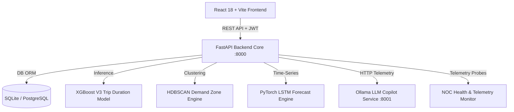

# Ride AI — Demand Forecasting & Enterprise Mobility Intelligence Platform

Ride AI is an enterprise-grade AI-powered mobility intelligence platform for modern urban ride-hailing and fleet operations. It integrates production Machine Learning services (**XGBoost V3 Trip Duration Engine**, **Spatial HDBSCAN Demand Clustering Engine**, and **PyTorch 2-Layer LSTM Demand Forecasting Engine**) with an **Ollama LLM Reasoning Copilot** to empower drivers with real-time dispatch guidance and fleet admins with NOC model health telemetry.

---

## 🎨 Architecture & Technology Stack



### Core Technologies
- **Frontend**: React 18, TypeScript, Material UI v5 (**Velour** Dark Palette), Leaflet Maps, React-Leaflet, Recharts, React Query, Vite.
- **Backend Core**: FastAPI, Python 3.10+, PyTorch 2.0+, XGBoost, Scikit-learn, SQLAlchemy ORM, Pydantic v2, Passlib (bcrypt), PyJWT, Uvicorn.
- **AI Copilot Microservice**: FastAPI + Ollama Gemma2/Llama3 (`:8001`) with cross-service context aggregation and offline fallback logic.
- **Database Layer**: SQLite / PostgreSQL with automated seeder lifespan triggers and transactional account management.
- **NOC Telemetry System**: Aggregated real-time metrics (System Health, Active Services, RPM, Avg Latency, Error Rate, Uptime) with reconnect probe triggers.

---

## 🔑 Working Demo Credentials

| Role | Name | Email | Password | Target Portal |
| :--- | :--- | :--- | :--- | :--- |
| **Driver** | **Aryan Jha** | `aryan.driver@rideai.demo` | `driver123` | `/driver/*` (Driver Operational Dashboard & AI Copilot) |
| **Admin** | **Suraj Panigrahi** | `suraj.admin@rideai.demo` | `admin123` | `/admin/*` (Fleet Operations & Enterprise NOC Panel) |

> [!NOTE]  
> Demo login buttons on the `/login` page automatically authenticate using these seed credentials.

---

## 📱 Role-Based Portal Capabilities

### 1. Driver Portal (`/driver/*`)
- **Driver Dashboard**: Bento grid layout with real-time earnings summary, current shift metrics, and active positioning guidance.
- **Live Demand Map**: Interactive Leaflet map with pickup/drop-off route picker, reverse-geocoding, driver GPS marker, and zonal demand heat overlays.
- **AI Driver Copilot**: Interactive chat assistant powered by Ollama LLM for real-time dispatch advice and spatial positioning strategy.
- **Driver Earnings & History**: Shift trip logs, fare breakdowns, and transparent demo data disclaimers.
- **5-Section Driver User Profile**:
  1. *Personal Information*: Full name, email, phone, avatar, verified identity status.
  2. *Driver Credentials & Standing*: Driver ID (`DRV-2026-8812`), rating (`4.94`), total trips (`1,284`), acceptance rate (`96.4%`), cancellation rate (`1.2%`), member since date.
  3. *Vehicle & Registration*: Make/model (`Toyota Camry Hybrid`), vehicle category, TLC license plate (`NYC-TLC-7782`), inspection status.
  4. *Account Security & Audit*: Created date, last active shift timestamp, JWT security status.
  5. *Performance Summary*: KPI grid displaying rating, trips, earnings, acceptance, and cancellation rates.
- **Dedicated Driver Settings**: AI positioning recommendations toggle, high-demand surge prioritization, navigation provider (Google/Waze/Apple/OSM), shift earnings target goals, account edits, and location privacy controls.
- **Driver Support Center**: AI Copilot guidance, 7-item knowledge base FAQ accordion, category-based ticket submission modal, and emergency roadside dispatch simulation with clear demo disclaimers.

### 2. Admin & Fleet Operations Portal (`/admin/*`)
- **Admin Fleet Dashboard**: Real-time fleet KPI overview, active driver count, request volume, and revenue metrics.
- **Driver Directory & Management**: Enterprise directory, real-time search, active/inactive filters, detail viewer, and transactional driver creation.
- **Enterprise Model Health & NOC Dashboard**:
  - *6 Top KPIs*: Overall System Health, Active ML Services (3/3), Requests / Minute, Average Latency, Error Rate, Platform Uptime.
  - *Production Services Roster*: Status cards for XGBoost Trip Duration, HDBSCAN Demand Clustering, PyTorch LSTM Forecast, and Ollama LLM Copilot.
  - *24-Point Telemetry Charts*: Recharts time-series streams of Latency (ms), Throughput (RPM), and System Error Rate.
  - *Service Diagnostic Drill-Down Modal*: Service metadata, memory usage, CPU/GPU utilization, live reconnection probes, and structured logs.
- **Dedicated Admin Settings**: Deployment environment selection (Demo/Staging/Production), regional hub network, ML forecast horizon, NOC alert latency thresholds, telemetry refresh rates, fleet capacity limits, and admin account controls.

---

## ⚡ Integrated Machine Learning Engines

| Engine | Architecture | Endpoint / Service | Purpose |
| :--- | :--- | :--- | :--- |
| **Trip Duration Intelligence** | XGBoost Regressor V3 (44 Spatial Features) | `POST /api/driver/trip-duration` | Evaluates coordinate pairs and spatial features to estimate trip duration in minutes and miles. |
| **Demand Zone Intelligence** | HDBSCAN Spatial Demand Clustering | `GET /api/demand-zones` | Clusters spatial demand data across NYC hubs to compute dynamic surge multipliers and recommended pickup zones. |
| **Demand Forecasting Engine** | PyTorch 2-Layer LSTM Neural Network | `GET /api/forecast` | Computes 24-hour auto-regressive demand predictions, peak volume detection, and hourly demand curves. |
| **AI Mobility Copilot** | Ollama Microservice + Gemma2 / Llama3 | `http://localhost:8001` | Generates context-aware positioning recommendations and conversational driver assistance. |

---

## 🔒 Security & Demo vs. Production Transparency

- **Role-Based Access Control (RBAC)**: All `/api/admin/*` and `/api/driver/*` routes enforce strict JWT token role verification.
- **Password Security**: Passwords hashed using bcrypt via `passlib`.
- **Demo vs. Production Transparency**: Simulated telemetry, demand zones, and emergency dispatch features are explicitly tagged with `DEMO ENVIRONMENT`, `DEMO TELEMETRY`, or `DEMO SIMULATED CAPABILITY` badges to provide professional transparency during project evaluation.

---

## 🚀 Installation & Running Locally

### Option A: One-Command Docker Setup (Recommended)

```bash
docker compose up --build
```

- **Frontend Application**: `http://localhost:3000`
- **Backend Core API**: `http://localhost:8000`
- **API Documentation (Swagger)**: `http://localhost:8000/docs`
- **Ollama LLM Microservice**: `http://localhost:8001`

To stop containers:
```bash
docker compose down
```

---

### Option B: Manual Local Setup

#### 1. Backend Setup
```bash
python3 -m venv backend/venv
source backend/venv/bin/activate
pip install -r backend/requirements.txt
python backend/seed.py
python backend/main.py
```

#### 2. LLM Microservice Setup (Optional)
```bash
python llm-service/main.py
```

#### 3. Frontend Setup
```bash
cd frontend
npm install
npm run dev
```

---

## 🧪 Testing & Verification

Run the automated backend test suite:
```bash
source backend/venv/bin/activate
python backend/run_tests.py
```

Run frontend build verification:
```bash
cd frontend
npm run build
```

---

## 📂 Project Directory Structure

```
Ride-Hailing-AI-Copy/
├── backend/
│   ├── app/
│   │   ├── api/             # FastAPI routers (admin, auth, demand_zones, driver_advice, forecast, trip_duration)
│   │   ├── core/            # Security, JWT, RBAC dependencies
│   │   ├── models/          # SQLAlchemy database entities
│   │   ├── schemas/         # Pydantic schemas
│   │   └── services/        # NOC telemetry, ML model adapters, LLM client
│   ├── models/              # Machine Learning weights & feature column specs
│   ├── seed.py              # Database seeder (Aryan Jha & Suraj Panigrahi credentials)
│   ├── main.py              # FastAPI server entry point
│   └── run_tests.py         # Test suite runner
├── frontend/
│   ├── src/
│   │   ├── auth/            # AuthContext, ProtectedRoute, role definitions
│   │   ├── components/      # Bento cards, header, sidebar, profile, NOC diagnostic modal
│   │   ├── pages/
│   │   │   ├── admin/       # Admin Dashboard, Admin Drivers, Admin Model Health NOC, Admin Settings
│   │   │   ├── driver/      # Driver Dashboard, Driver Profile, Driver Settings, Trips, AI Assistant
│   │   │   └── common/      # Live Demand Map, Forecast Analytics, Support
│   │   ├── routes/          # Centralized route definitions
│   │   └── services/        # Axios API client & reverse-geocoding service
├── llm-service/             # Ollama LLM copilot microservice (:8001)
├── docker-compose.yml
└── README.md
```

---

## 📝 Commit Convention & License

Project updates follow Conventional Commits standard. Developed as an advanced AI mobility intelligence prototype.